# 👀 dir_viz 👀

**A collection of CLI tools that transform directory structures into stunning visual diagrams!**

This project currently contains 4 tools for visualizing directory structures and similar tasks:

- **flowcharter.py**: Generates animated SVG flowcharts of your directory structure with neon effects and glowing animations.
- **mermaider.py**: Creates clean Mermaid diagrams of your directory structure for documentation and presentations.
- **mapper**: A fast Rust tool that generates interactive SVG visualizations and draw.io diagrams of directory structures with neon-themed design, collapsible nodes, and auto-launch functionality.
- **repomixr**: A Python script (located in the `repomixr/` directory) that processes GitHub repositories. It clones specified repositories, runs the `npx repomix` command (a Node.js tool) to analyze their content (excluding many common non-source files like documentation, binaries, and build artifacts), and saves the resulting `repomix-output.xml` to a configurable output directory (default `repomixd/`). It supports processing multiple repositories concurrently and can take input from command-line arguments or a source file.

All tools feature performance optimizations including memory-efficient scanning, cached operations, and smart exclusion patterns for build/cache folders.

## Features

### Flowcharter (flowcharter.py)

- **Animated SVG Output:** Creates eye-popping flowcharts with glowing nodes, pulsing edges, and smooth animations
- **Neon Theming:** Cyberpunk-inspired color schemes with customizable palettes
- **Performance Optimized:** Memory-efficient scanning with cached font loading and node generation
- **Graphviz Integration:** Robust layouts using pydot and Graphviz
- **Multiple Formats:** Outputs both DOT and animated/static SVG files

### Mermaider (mermaider.py)  

- **Mermaid Diagrams:** Generates clean, documentation-ready Mermaid syntax
- **Smart Formatting:** Automatic node styling and hierarchy visualization
- **Configurable Output:** Customizable styling and structure options

### Mapper (mapper/)

- **Interactive SVG Output:** Generates interactive SVG visualizations with collapsible directory nodes
- **Dual Format Support:** Creates both SVG files and draw.io diagrams simultaneously  
- **Neon-Themed Design:** Cyberpunk-inspired visual styling with glowing effects and curved connectors
- **Fast Rust Implementation:** High-performance directory scanning with smart filtering
- **Auto-Launch Integration:** Automatically opens draw.io in browser with generated diagram
- **Smart Filtering:** Excludes common build/cache directories (target, gen, hidden folders)

### Repomixr (repomixr/repomixr.py)

- **Batch Repo Analysis:** Clones one or more GitHub repositories, removes git metadata, and runs npx repomix to generate summary XML files.
- **Flexible Input:** Accepts repo names as CLI arguments or from a text file (SOURCE_REPOS_TXT_FILE).
- **Automated Cleanup:** Cleans up all temporary files and supports parallel processing for speed.
- **Custom Output:** Stores XML reports in a configurable output directory (OUTPUT_DIR).
- **Authentication Support:** Can use a GitHub token for private repos via GitHub CLI.

### Workflow Guidance

For optimal results run the repomixr/workflow/ prompts in sequential order. This ensures that each step correctly builds upon the previous ones, leading to the most effective and accurate outcomes.

### Shared Features

- **Smart Exclusions:** Automatically filters out build folders, caches, and common artifacts
- **Parallel Processing:** Optional multi-threaded directory scanning for large projects
- **Modular Architecture:** Clean, maintainable codebase with shared utilities
- **Flexible Configuration:** Centralized settings for colors, patterns, and behavior

## Example Output

**Flowcharter** generates animated SVGs with glowing effects:



- Nodes pulse and glow with neon colors
- Edges animate with flowing dashes
- Hover effects for interactive exploration
- Embedded fonts for consistent rendering

**Mermaider** creates clean Mermaid diagrams:

- Perfect for documentation and README files
- Compatible with GitHub, GitLab, and Mermaid Live
- Hierarchical structure with proper styling

## Installation & Setup

**Prerequisites:**

- Python 3.6+
- Rust 1.70+ and Cargo (for mapper tool)
- Graphviz (system package)

**Install system dependencies:**

```bash
# Ubuntu/Debian
sudo apt-get install graphviz

# macOS
brew install graphviz

# Windows (using chocolatey)
choco install graphviz
```

**Install Rust (for mapper tool):**

```bash
# Install Rust via rustup
curl --proto '=https' --tlsv1.2 -sSf https://sh.rustup.rs | sh
source ~/.cargo/env

# Or via package manager:
# Ubuntu/Debian: sudo apt install rustc cargo
# macOS: brew install rust
# Windows: Download from https://rustup.rs/
```

**Install Python dependencies:**

```bash
pip install pydot tqdm
```

**Quick start:**

```bash
# Generate animated SVG flowchart
python flowcharter.py /path/to/your/project

# Generate Mermaid diagram
python mermaider.py /path/to/your/project -o project.mermaid

# Generate interactive SVG + draw.io diagram (fast!)
cd mapper && cargo run
```

## Usage

### Flowcharter (Animated SVG)

```bash
# Basic usage - generates flowchart.svg in current directory
python flowcharter.py /path/to/your/project

# Advanced options
python flowcharter.py /path/to/your/project \
  -o mychart.svg \
  --dot-output mychart.dot \
  --parallel \
  --max-depth 8 \
  --open

# Static SVG (no animation)
python flowcharter.py /path/to/your/project --no-animation

# Quiet mode for scripts
python flowcharter.py /path/to/your/project --quiet
```

### Mermaider (Mermaid Diagrams)

```bash
# Basic usage - generates project_structure.mermaid
python mermaider.py /path/to/your/project

# Custom output file
python mermaider.py /path/to/your/project -o project.mermaid

# With depth limit
python mermaider.py /path/to/your/project --max-depth 5
```

### Mapper (Interactive SVG + Draw.io)

```bash
# Generate interactive SVG and draw.io diagram (from mapper directory)
cd mapper
cargo run

# Build optimized release version
cargo build --release
./target/release/mapper

# The tool generates:
# - repo_map.svg (interactive SVG with collapsible nodes)
# - repo_map.drawio (draw.io diagram file)
# - Automatically opens draw.io in browser
```

### Repomixr

```bash
# Analyze a repo
python repomixr/repomixr.py bitcoin/bitcoin

# Analyze multiple repos from a file
export SOURCE_REPOS_TXT_FILE=my_repos.txt
python repomixr/repomixr.py
```

**Viewing Results:**

- SVG files: Open in any modern browser to see animations
- Interactive SVG (mapper): Click directory nodes to collapse/expand, hover for effects
- Draw.io files: Open in draw.io or automatically launched in browser by mapper
- Mermaid files: Copy content to [mermaid.live](https://mermaid.live) or use in documentation

## How It Works

### Flowcharter Process

1. **Scans** directory recursively with memory-efficient generators
2. **Creates** DOT graph using pydot with optimized node generation
3. **Applies** neon color schemes and styling
4. **Generates** SVG with embedded CSS animations
5. **Adds** glowing effects, pulsing nodes, and animated edges

### Mermaider Process

1. **Traverses** directory structure with smart exclusions
2. **Builds** hierarchical node relationships
3. **Applies** Mermaid syntax formatting
4. **Outputs** clean diagram code ready for documentation

### Mapper Process

1. **Scans** directory recursively with Rust-powered performance
2. **Filters** out build/cache directories (target, gen, hidden folders)
3. **Generates** interactive SVG with neon styling and collapsible nodes
4. **Creates** draw.io XML diagram with proper layout and compression
5. **Launches** draw.io automatically in browser with generated diagram

## Customization

The tools use a modular configuration system:

- **Color schemes**: Modify `NEON_COLORS` and color palettes in the source
- **Exclusion patterns**: Update `DEFAULT_EXCLUDE_DIRS` for different project types
- **Animation settings**: Adjust CSS animations in the SVG generation
- **Mermaid styling**: Customize node shapes and styling in Mermaid output

## Dependencies

- **Python 3.6+**
- **Rust 1.70+** and Cargo (for mapper tool)
- **System**: `graphviz` package
- **Python packages**: `pydot`, `tqdm`
- **Rust packages**: `webbrowser`, `base64`, `flate2`, `urlencoding` (auto-installed via Cargo)

## Project Structure

```text
directory-visualization-tools/
├── flowcharter.py              # Animated SVG flowchart generator
├── mermaider.py               # Mermaid diagram generator
├── mapper/                    # Fast Rust interactive SVG/draw.io generator
│   ├── Cargo.toml            #   Rust project configuration
│   ├── Cargo.lock            #   Dependency lock file
│   ├── README.md             #   Mapper-specific documentation
│   ├── repo_map.drawio       #   Generated draw.io diagram
│   ├── repo_map.svg          #   Generated interactive SVG
│   └── src/                  #   Rust source code
│       ├── main.rs           #     Main application logic
│       ├── drawio_*.rs       #     Draw.io format modules
│       ├── svg_defs.svg      #     SVG filter definitions
│       └── svg_script.js     #     Interactive behavior
├── repomixr/                  # Repository analysis and management tool
├── config/                    # Configuration modules
│   ├── __init__.py           #   Shared constants and imports
│   ├── mermaid.py            #   Mermaid-specific settings
│   └── visualization.py      #   Color schemes and SVG settings
├── utils/                     # Shared utilities
│   ├── __init__.py           #   Common functions and classes
│   ├── cli_common.py         #   CLI argument handling
│   ├── directory_scanner.py  #   Optimized directory traversal
│   └── file_operations.py    #   Safe file I/O operations
└── README.md                  # This file
```

## Tool Details

### `flowcharter.py`

**Generates animated SVG flowcharts with neon effects**

**Command line options:**

```bash
python flowcharter.py <directory> [options]
  -o, --output FILE         Output SVG file (default: flowchart.svg)
  --dot-output FILE         Output DOT file (default: flowchart.dot)  
  --no-animation           Generate static SVG
  --parallel               Use parallel processing
  --max-depth N            Limit directory depth
  --quiet                  Suppress progress output
  --open                   Open result in browser
```

### `mermaider.py`  

**Creates clean Mermaid diagrams for documentation**

**Command line options:**

```bash
python mermaider.py <directory> [options]
  -o, --output FILE         Output Mermaid file
  --max-depth N            Limit directory depth
  --quiet                  Suppress progress output
```

### `mapper` (Rust)

**Generates interactive SVG visualizations and draw.io diagrams**

**Usage:**

```bash
cd mapper
cargo run                 # Generate both SVG and draw.io outputs
cargo build --release     # Build optimized executable
```

**Features:**
- Interactive SVG with collapsible directory nodes
- Neon-themed visual design with glowing effects  
- Automatic draw.io launch in browser
- Smart filtering of build/cache directories
- Fast Rust-powered directory scanning

## Performance Features

- **Memory Efficient**: Generator-based directory scanning
- **Cached Operations**: Font loading and node generation with LRU caching  
- **Smart Exclusions**: Pre-compiled regex patterns for common build/cache folders
- **Parallel Processing**: Optional multi-threaded scanning for large projects
- **Optimized Rendering**: Efficient SVG generation with embedded animations

## Contributing

Contributions are welcome! Feel free to:

- Report bugs or request features via issues
- Submit pull requests for improvements
- Share examples of generated visualizations
- Suggest new output formats or styling options

## Author

sister

---

> "Transform your directory structures into visual masterpieces!"
